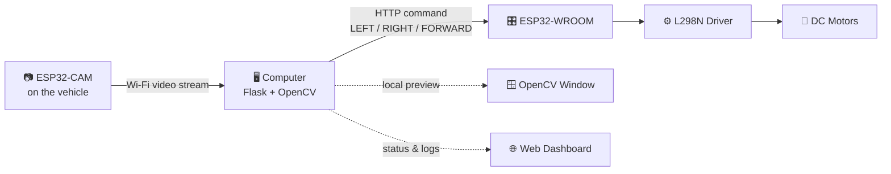
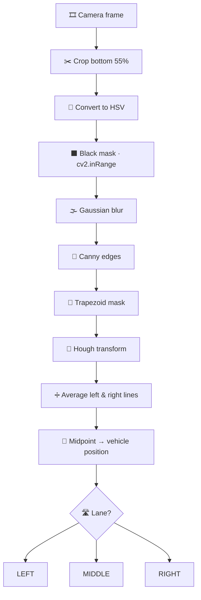

<div align="center">

# 🚗 Smart Vehicle Lane Detection & Control System

### *Let the road guide the car — AI vision meets ESP32 hardware.*

A camera sees the road. OpenCV finds the lanes. Flask makes the decision.
An ESP32 steers the wheels. All over Wi-Fi.

<br>


<br>

[🚀 Quick Start](#-quick-start-no-hardware-needed) •
[🏗️ Architecture](#️-how-it-works) •
[🔌 Hardware](#-hardware-setup) •
[🧠 Lane Logic](#-lane-detection-pipeline) •
[🐛 Troubleshooting](#-troubleshooting)

</div>

---

## ✨ Highlights

| | Feature | What it does |
|---|---|---|
| 👁️ | **Real-time lane detection** | OpenCV pipeline using HSV masking, Canny edges and Hough transform |
| 🧭 | **Smart lane preference** | Cars drift to the **right** lane, trucks to the **left** |
| 📡 | **Wireless control** | Commands travel over Wi-Fi to the ESP32 motor controller |
| 🖥️ | **Live web dashboard** | Dark-themed UI with status, lane, direction and a live signal log |
| 🧪 | **Hardware-free testing** | Run the whole system with just your laptop webcam |
| 🔁 | **Overtake command** | One-click `OVERTAKE` signal from the dashboard |

---

## 🏗️ How It Works



1. 📷 The **ESP32-CAM** captures live road video and streams it over Wi-Fi.
2. 🧠 **Flask + OpenCV** read the stream, detect lanes and show a local preview window.
3. 🧭 The **Flask backend** picks a direction: `LEFT`, `RIGHT` or `FORWARD`.
4. 📨 An **HTTP command** is sent to the **ESP32-WROOM**, which drives the motors.

---

## 🚀 Quick Start (No Hardware Needed)

Try the entire system with only your laptop webcam. Commands are printed to the terminal, so nothing moves.

**1️⃣ Install dependencies**

```bash
cd car_truck_2
pip install -r requirements.txt
```

**2️⃣ Turn on test mode**

```python
# esp32_controller.py
TEST_MODE = True              # No real hardware needed

# lane_detection.py
USE_WEBCAM_FOR_TEST = True    # Uses your laptop camera
```

**3️⃣ Launch the server**

```bash
python app.py
```

**4️⃣ Open the dashboard** → **http://127.0.0.1:5000**

1. Choose **🚗 CAR** or **🚛 TRUCK**
2. Press **▶ START** — a local OpenCV window pops up with live lane detection
3. Watch the signal log update in real time
4. Press **■ STOP** when you're done

> [!NOTE]
> The camera feed does **not** appear in the browser. It opens as a **local OpenCV window** on the computer running the server.

---

## 📁 Project Structure

<details>
<summary><b>Click to expand</b></summary>

```
car_truck_2/
├── app.py                  # Flask backend (main server)
├── lane_detection.py       # OpenCV lane detection logic
├── esp32_controller.py     # Sends commands to ESP32-WROOM
├── requirements.txt        # Python dependencies
│
├── templates/
│   ├── index.html          # Vehicle selection homepage
│   └── dashboard.html      # Control dashboard
│
├── static/
│   ├── style.css           # Dark theme styling
│   └── script.js           # Dashboard JavaScript
│
└── esp32/
    ├── ESP32_WROOM/
    │   └── ESP32_WROOM.ino # Motor controller firmware
    └── ESP32_CAM/
        └── ESP32_CAM.ino   # Camera stream firmware
```

</details>

---

## 🔌 Hardware Setup

### 🧰 What you'll need

| Component | Purpose |
|---|---|
| 📷 ESP32-CAM | Camera mounted on the vehicle |
| 🎛️ ESP32-WROOM | Motor controller |
| ⚙️ L298N motor driver | Drives the DC motors |
| 🛞 2× DC motors | Drive the vehicle wheels |
| 🔋 Power bank / battery | Powers the vehicle |
| 🔗 USB cable | Programs the ESP32 boards |

### 🔧 Wiring

<details>
<summary><b>L298N → ESP32-WROOM</b></summary>

| L298N Pin | ESP32 GPIO | Function |
|---|---|---|
| IN1 | GPIO 14 | Motor A direction |
| IN2 | GPIO 27 | Motor A direction |
| ENA | GPIO 12 | Motor A speed |
| IN3 | GPIO 26 | Motor B direction |
| IN4 | GPIO 25 | Motor B direction |
| ENB | GPIO 13 | Motor B speed |
| GND | GND | Common ground |
| 5V | 5V | Logic power |

</details>

<details>
<summary><b>DC Motors → L298N</b></summary>

| Motor | L298N Terminals |
|---|---|
| Left wheel | OUT1, OUT2 |
| Right wheel | OUT3, OUT4 |

</details>

> [!WARNING]
> Always connect the **GND** of the ESP32 and the L298N together. A missing common ground is the most frequent cause of motors not responding.

### 📷 Step A — Flash the ESP32-CAM

1. Open `esp32/ESP32_CAM/ESP32_CAM.ino` in the Arduino IDE.
2. Add your Wi-Fi credentials:
   ```cpp
   const char* WIFI_SSID     = "YOUR_WIFI_NAME";
   const char* WIFI_PASSWORD = "YOUR_PASSWORD";
   ```
3. Select board **AI-Thinker ESP32-CAM** and upload.
4. Open the Serial Monitor at **115200 baud**, press Reset, and copy the IP address.
5. Update `lane_detection.py`:
   ```python
   ESP32_CAM_URL = "http://YOUR_CAM_IP/stream"
   USE_WEBCAM_FOR_TEST = False
   ```

### 🎛️ Step B — Flash the ESP32-WROOM

1. Open `esp32/ESP32_WROOM/ESP32_WROOM.ino` in the Arduino IDE.
2. Add your Wi-Fi credentials (same as above).
3. Select board **ESP32 Dev Module** and upload.
4. Open the Serial Monitor and copy the IP address.
5. Update `esp32_controller.py`:
   ```python
   ESP32_WROOM_IP = "YOUR_WROOM_IP"
   TEST_MODE = False
   ```

> [!TIP]
> Keep the computer, ESP32-CAM and ESP32-WROOM on the **same Wi-Fi network** for the lowest latency.

---

## 🧠 Lane Detection Pipeline

The road frame is split into three equal zones:

```
 ┌────────────┬────────────┬────────────┐
 │    LEFT    │   MIDDLE   │   RIGHT    │
 └────────────┴────────────┴────────────┘
 0           w/3          2w/3          w
```



| Step | Operation | Why it matters |
|---|---|---|
| 1 | **Crop** | Keeps only the bottom 55% — the road area |
| 2 | **HSV conversion** | Colour detection that's robust to lighting |
| 3 | **Black mask** | Isolates dark lane markings |
| 4 | **Gaussian blur** | Smooths out noise |
| 5 | **Canny edges** | Finds line boundaries |
| 6 | **Trapezoid mask** | Ignores sky and walls |
| 7 | **Hough transform** | Extracts straight lane lines |
| 8 | **Line averaging** | One clean left and right boundary |
| 9 | **Midpoint** | Calculates the vehicle's position |
| 10 | **Classification** | Outputs `LEFT`, `MIDDLE` or `RIGHT` |

---

## 🚦 Vehicle Control Logic

<table>
<tr>
<td valign="top" width="50%">

### 🚗 CAR — prefers the **RIGHT** lane

| Current Lane | Command |
|---|---|
| ⬅️ LEFT | ➡️ **RIGHT** |
| ⏺️ MIDDLE | ➡️ **RIGHT** |
| ➡️ RIGHT | ⬆️ **FORWARD** |

</td>
<td valign="top" width="50%">

### 🚛 TRUCK — prefers the **LEFT** lane

| Current Lane | Command |
|---|---|
| ➡️ RIGHT | ⬅️ **LEFT** |
| ⏺️ MIDDLE | ⬅️ **LEFT** |
| ⬅️ LEFT | ⬆️ **FORWARD** |

</td>
</tr>
</table>

---

## 🖥️ Dashboard

| Feature | Description |
|---|---|
| 🟢 **Vehicle Status** | Shows `RUNNING` or `STOPPED` |
| 🛣️ **Current Lane** | Shows `LEFT`, `MIDDLE` or `RIGHT` |
| 🧭 **Direction** | Current command: ← → ↑ ■ |
| 📜 **Signal Logs** | Live feed of every event and command |
| ▶️ **START** | Starts detection and opens the OpenCV window |
| ⏹️ **STOP** | Stops detection and the motors |
| 🏎️ **OVERTAKE** | Sends an `OVERTAKE` command to the ESP32 |

<!-- Add a screenshot of your dashboard here:
<p align="center"></p>
-->

### 📋 Sample log output

```log
[INFO]    CAR STARTED
[INFO]    CAMERA CONNECTED
[INFO]    CAR is in LEFT lane
[COMMAND] RIGHT
[INFO]    CAR is in RIGHT lane – MAINTAIN
[COMMAND] FORWARD
[INFO]    CAR STOPPED
```

---

## 🐛 Troubleshooting

<details>
<summary><b>📷 <code>Camera could not be opened</code></b></summary>

Check the ESP32-CAM IP address, or set `USE_WEBCAM_FOR_TEST = True` to use your laptop camera.

</details>

<details>
<summary><b>📡 <code>Cannot connect to ESP32</code></b></summary>

Check the ESP32-WROOM IP address, or set `TEST_MODE = True` to run without hardware.

</details>

<details>
<summary><b>🌐 Dashboard not loading</b></summary>

Make sure Flask is running with `python app.py`, then open http://127.0.0.1:5000.

</details>

<details>
<summary><b>🛣️ No lanes detected</b></summary>

Improve the lighting and adjust `BLACK_LOWER` / `BLACK_UPPER` in `lane_detection.py`.

</details>

<details>
<summary><b>🪟 OpenCV window not showing</b></summary>

Make sure you are not running in a headless environment (for example, over SSH without a display).

</details>

---

## 📦 Tech Stack

| Package | Role |
|---|---|
|  | Web server and routing |
|  | Camera capture and lane detection |
|  | Math and array operations |
|  | HTTP calls to the ESP32 |

```bash
pip install -r requirements.txt
```

---

## 💡 Ideas for Future Improvements

- [ ] Smoother steering with PID control instead of discrete commands
- [ ] Obstacle detection with an ultrasonic sensor
- [ ] Browser-based live video preview
- [ ] Adaptive thresholds for changing light conditions

---

<div align="center">

**Built with 💙 using Python, OpenCV and ESP32**

⭐ If this project helped you, consider giving it a star!

</div>
